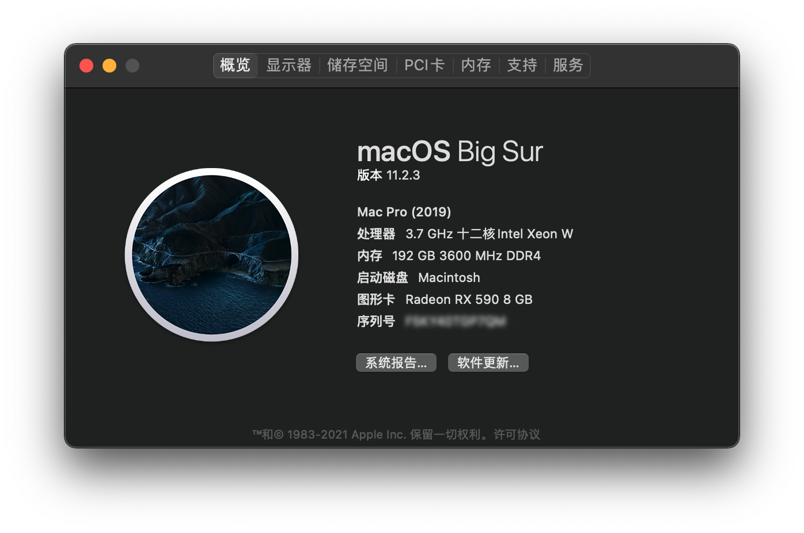

English | [简体中文](./README.md)

# EFI folder for Ryzen hackintosh installation

OpenCore Version: v0.6.8

macOS Version: Big Sur(11.2.3)

## Specification

| Component         | Model                                                       |
| ----------------- | ----------------------------------------------------------- |
| CPU               | AMD Ryzen 9 5900X 12-Cores @ 3.7GHz                         |
| MotherBoard       | ASUS ROG Strix X570-E Gaming                                |
| GPU               | Sapphire Radeon RX 590 Nitro+ 8G G5                         |
| RAM               | 32 GB (16GB × 2) Corsair Vengeance RGB Pro DDR4 @ 3200MHz   |
| SSD               | 1TB WD Black SN750, 500GB Samsung 860 EVO SATA              |
| Wireless Ethernet | Build-in Intel AX200                                        |
| Ethernet          | Build-in Intel I211-AT 1G, Build-in Realtek RTL8125-CG 2.5G |

## Installation

1. Create [macOS installer](https://dortania.github.io/OpenCore-Install-Guide/installer-guide/mac-install.html#downloading-macos-modern-os).
2. Use [GenSMBIOS](https://github.com/corpnewt/GenSMBIOS) to generate your SMBIOS data for your `config.plist`.
3. Follow [Dortania's OpenCore Big Sur Installation Guide](https://dortania.github.io/OpenCore-Install-Guide/extras/big-sur/#table-of-contents).

## Working

- WIFI, Bluetooth*, Ethernet within MotherBoard (2.5G and 1G)
- iMessage, iCloud, FaceTime, App Store, Apple Music
- HandOff, AirPlay
- All USB ports
- Sleep and Wake-up

\* Sometimes it doesn't work when it wake up from a long time sleeping.

## Not Working

- AirDrop, Sidecar
- Authenticate with Apple Watch

## FAQ

### Q: Docker show "it's not compatible with this(AMD) architecture" OR VMware is not working

A: Install VirtualBox and install a Linux virtual machine on it.